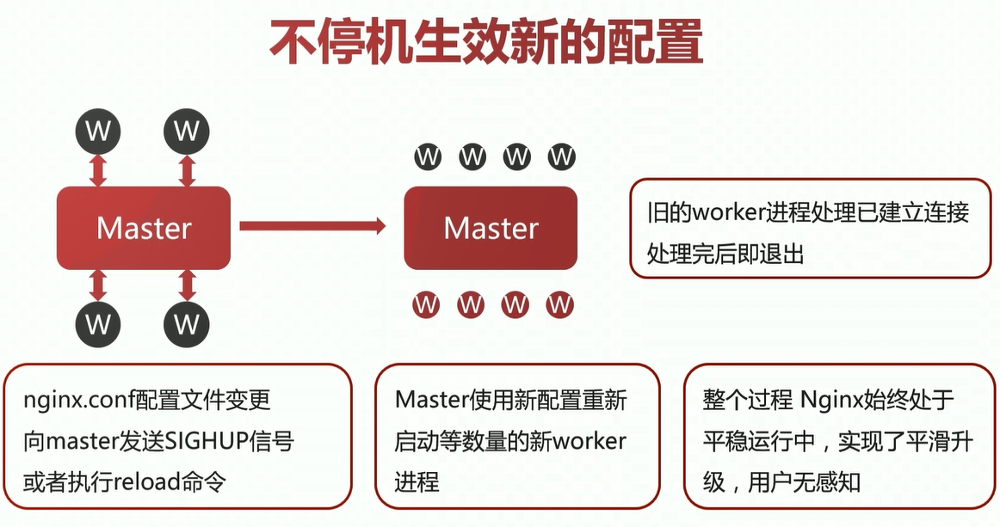

# 常见应用场景

- 静态资源服务
- 反向代理服务
- API服务

# 基本命令

**启动Nginx**

```bash
$ nginx
```

**nginx -s **

```bash
$ nginx -s quit # 优雅停止
$ nginx -s stop # 立即停止
$ nginx -s reload # 重新加载配置文件
$ nginx -s reopen # 重新打开配置文件
```

**查看安装目录、配置文件位置等**

```bash
$ nginx -V
```

**检查配置文件是否正确**

```bash
$ nginx -t
```

# 文件路径

安装位置：`/user/sbin/nginx`

配置文件：`/etc/nginx.conf`

日志文件：`/var/log/nginx`

# 配置文件结构

Nginx的配置⽂件是由⼀系列的指令组成的，每个指令都是由⼀个指令名和⼀个或者多个参数组成的。

指令和参数之间使⽤空格来分隔，指令以分号 ; 结尾，参数可以使⽤单引号或者双引号来包裹。

```nginx
# 全局块
worker_processes  1;

events {
  # events块
}
http {
  # http块
 server {
    # server块
   location / {
      # location块
   }
 }
}
```

## 默认配置文件

```nginx
user  nginx;
worker_processes  auto;

error_log  /var/log/nginx/error.log notice;
pid        /var/run/nginx.pid;


events {
    worker_connections  1024;
}


http {
    include       /etc/nginx/mime.types;
    default_type  application/octet-stream;

    log_format  main  '$remote_addr - $remote_user [$time_local] "$request" '
                      '$status $body_bytes_sent "$http_referer" '
                      '"$http_user_agent" "$http_x_forwarded_for"';

    access_log  /var/log/nginx/access.log  main;

    sendfile        on;
    #tcp_nopush     on;

    keepalive_timeout  65;

    #gzip  on;

    include /etc/nginx/conf.d/*.conf;
}
```

## 全局块

```nginx
# 指定运⾏Nginx服务器的⽤户，只能在全局块配置
# 将user指令注释掉，或者配置成nobody的话所有⽤户都可以运⾏
# user [user] [group]
# user nobody nobody;
user nginx;

# 指定⽣成的worker进程的数量，也可使⽤⾃动模式，只能在全局块配置
worker_processes  1;

# 错误⽇志存放路径和类型
error_log /var/log/nginx/error.log warn;

# 进程PID存放路径
pid    /var/run/nginx.pid;
```

### 核心参数

- **user USERNAME [GROUP]**

  - **解释：** 指定运行 nginx 的 worker 子进程的属主和属组
  - **示例：**  user nginx nginx;

- **pid DIR**

  - **解释：** 指定运行nginx的master主进程和pid文件存放路径
  - **示例：** pid /opt/nginx/logs/nginx.pid;

- **worker_rlimit_nofile number**

  - **解释：** 指定worker子进程可以打开的最大文件句柄数
  - **示例：**worker_rlimit_nofile 20480;

- **worker_rlimit_core size**

  - **解释：** 指定worker子进程异常终止后的core文件，用于记录分析问题

  - **示例：** worker_rlimit_core 50M;

    ​	     working_directory   /opt/nginx/tmp; # 这个目录对于nginx用户应当有写权限

- **worker_processes number | auto**

  - **解释：** 指定 nginx 启动的 worker 子进程数量

  - **示例：** worker_processes 4;

    ​	     worker_processes auto;

- **worker_cpu_affinity cpumask1 cpumask2**

  - **解释：** 将每个 worker 子进程与我们的CPU物理核心绑定

  - **示例：**worker_cpu_affinity 0001 0010 0100 1000; # 4 个物理核心，4个worker子进程

    ​	   worker_cpu_affinity 00000001 00000010 00000100 00001000 00010000 00100000 01000000 10000000; # 8物理核心，8个worker子进程

    ​	   worker_cpu_affinity 01 10 01 10；# 2个物理核心，4个子进程

  - **备注：** 将每个worker子进程与特定CPU物理核心绑定，优势在于:避免同一个worker子进程在不同的CPU核心上切换，缓存失效，降低性能；其并不能真正的避免进程切换

- **worker_priority number**

  - **解释：** 指定 nginx 子进程的nice值，以调整运行 nginx 的优先级，通常设定为负值，以优先调用nginx
  - **示例：** worker_priority -10;
  - **备注:**   Linux 默认进程的优先级值是120，值越小越优先；nice设定范围为 -20 到 +19

- **worker_shutdown_timeout time**

  - **解释：** 指定 worker 子进程优雅退出的超时时间
  - **示例：** worker_shutdown_timeout 5s;

- **timer_resolution interval**

  - **解释：** worker 子进程内部使用的计时器精度，调整时间间隔越大，系统调用越少，有利于性能提升；反之，系统调用越多，性能下降
  - **示例：** timer_resolution  100ms;

- **daemon on|off**

  - **解释：** 设定 nginx 的运行方式，前台还是后台，前台用于调试，后台用于生产
  - **示例：** daemon off;

- lock_file : 负载均衡互斥锁文件存放路径

  lock_file  log/nginx.log;

## events 块

```nginx
events {
  # 指定使⽤哪种⽹络IO模型，只能在events块中进⾏配置
  # use epoll
  # 每个worker process允许的最⼤连接数
 worker_connections  1024;
}
```

### 核心参数

| 参数               | 含义                                                         |
| ------------------ | ------------------------------------------------------------ |
| use                | nginx使用何种事件驱动模型                                    |
| worker_connections | worker子进程能够处理的最大并发连接数                         |
| accept_mutex       | 是否打开负载均衡互斥锁（不打开时master通知每一个worker）     |
| accept_mutex_delay | 新连接分配给worker子进程的超时时间（等待worker响应不换worker的最大时间） |
| muti_accept        | 它用于控制工作进程如何接受新的连接。当这个参数被启用（设置为 `on`）时，它允许一个工作进程在一次轮询（select/poll/epoll_wait）调用中接受所有等待的连接，而不是一次只接受一个。 |

#### use

- 语法：use method
- method 可选值：select、poll、kqueue、epoll、/dev/poll、eventport
- 默认配置：无
- 推荐配置：不指定，让nginx自己选择

#### worker_connections

- 语法：worker_connections number
- 默认配置：worker_connections 1024
- 推荐配置：worker_connections  65535/worker_connections | 65535

#### accept_mutex

- 语法：accept_mutex on | off
- 可选值：on、off
- 默认配置：accept_mutex off
- 推荐配置：accept_mutex on

#### accept_mutex_delay

- 语法：accept_mutex_delay time
- 默认配置：accept_mutex_delay 500ms
- 推荐配置：accept_mutex_delay 100ms

#### multi_accept

- 语法：multi_accept on|off
- 可选值：on、off
- 默认配置：multi_accept off
- 推荐配置：根据具体负载情况和性能测试决策。（不用管也没啥事）

## http块

http块是配置⽂件的主要部分，包括http全局块和server块。

```nginx
http {
  # nginx 可以使⽤include指令引⼊其他配置⽂件
 include    /etc/nginx/mime.types;
  # 默认类型，如果请求的URL没有包含⽂件类型，会使⽤默认类型
 default_type application/octet-stream;  # 默认类型
  # 开启⾼效⽂件传输模式
 sendfile    on;
  # 连接超时时间
 keepalive_timeout  65;
  # access_log ⽇志存放路径和类型
  # 格式为：access_log <path> [format [buffer=size] [gzip[=level]]
[flush=time] [if=condition]];
 access_log /var/log/nginx/access.log main;
  # 定义⽇志格式
 log_format main  '$remote_addr - $remote_user [$time_local]
"$request" '
            '$status $body_bytes_sent "$http_referer" '
           '"$http_user_agent" "$http_x_forwarded_for"';
  # 设置sendfile最⼤传输⽚段⼤⼩，默认为0，表示不限制
  # sendfile_max_chunk 1m;
  # 每个连接的请求次数
  # keepalive_requests 100;
  # keepalive超时时间
 keepalive_timeout  65;
  # 开启gzip压缩
  # gzip on;
  # 开启gzip压缩的最⼩⽂件⼤⼩
  # gzip_min_length 1k;
  # gzip压缩级别，1-9，级别越⾼压缩率越⾼，但是消耗CPU资源也越多
  # gzip_comp_level 2;
  # gzip压缩⽂件类型
  # gzip_types text/plain application/javascript application/x-javascript text/css application/xml text/javascript application/x-httpd-php image/jpeg image/gif image/png;
  # upstream指令⽤于定义⼀组服务器，⼀般⽤来配置反向代理和负载均衡
 upstream www.example.com {
    # ip_hash指令⽤于设置负载均衡的⽅式，ip_hash表示使⽤客户端的IP进⾏hash，这样可以保证同⼀个客户端的请求每次都会分配到同⼀个服务器，解决了session共享的问题
   ip_hash;
    # weight ⽤于设置权重，权重越⾼被分配到的⼏率越⼤
   server 192.168.50.11:80 weight=3;
   server 192.168.50.12:80;
   server 192.168.50.13:80;
 }

 server {
    # 参考server块的配置
 }
}
```

## Server块

server块是配置虚拟主机的，⼀个http块可以包含多个server块，每个server块就是⼀个虚拟主机。

```nginx
server {
  # 监听IP和端⼝
  # listen的格式为：
  # listen [ip]:port [default_server] [ssl] [http2] [spdy]
[proxy_protocol] [setfib=number] [fastopen=number] [backlog=number];
  # listen指令⾮常灵活，可以指定多个IP和端⼝，也可以使⽤通配符
  # 下⾯是⼏个实际的例⼦：
  # listen 127.0.0.1:80; # 监听来⾃127.0.0.1的80端⼝的请求
  # listen 80; # 监听来⾃所有IP的80端⼝的请求
  # listen *:80; # 监听来⾃所有IP的80端⼝的请求，同上
  # listen 127.0.0.1; # 监听来⾃来⾃127.0.0.1的80端⼝，默认端⼝为80
 listen    80;
  # server_name ⽤来指定虚拟主机的域名，可以使⽤精确匹配、通配符匹配和正则匹配等
⽅式
  # server_name example.org www.example.org; # 精确匹配
  # server_name *.example.org;        # 通配符匹配
  # server_name ~^www\d+\.example\.net$;   # 正则匹配
 server_name localhost;
  # location块⽤来配置请求的路由，⼀个server块可以包含多个location块，每个
location块就是⼀个请求路由
  # location块的格式是：
  # location [=|~|~*|^~] /uri/ { ... }
  # = 表示精确匹配，只有完全匹配上才能⽣效
   # ~ 表示区分⼤⼩写的正则匹配
  # ~* 表示不区分⼤⼩写的正则匹配
  # ^~ 表示普通字符匹配，如果匹配成功，则不再匹配其他location
  # /uri/ 表示请求的URI，可以是字符串，也可以是正则表达式
  # { ... } 表示location块的配置内容
 location / {
    # root指令⽤于指定请求的根⽬录，可以是绝对路径，也可以是相对路径
   root  /usr/share/nginx/html;  # 根⽬录
    # index指令⽤于指定默认⽂件，如果请求的是⽬录，则会在⽬录下查找默认⽂件
   index index.html index.htm;  # 默认⽂件
 }
  # 下⾯是⼀些location的示例：
 location = / { # 精确匹配请求
   root  /usr/share/nginx/html;
   index index.html index.htm;
 }
 location ^~ /images/ { # 匹配以/images/开头的请求
   root  /usr/share/nginx/html;
 }
 location ~* \.(gif|jpg|jpeg)$ { # 匹配以gif、jpg或者jpeg结尾的请求
   root  /usr/share/nginx/html;
 }
 location !~ \.(gif|jpg|jpeg)$ { # 不匹配以gif、jpg或者jpeg结尾的请求
   root  /usr/share/nginx/html;
 }
 location !~* \.(gif|jpg|jpeg)$ { # 不匹配以gif、jpg或者jpeg结尾的请求
   root  /usr/share/nginx/html;
 }
  # error_page ⽤于指定错误⻚⾯，可以指定多个，按照优先级从⾼到低依次查找
 error_page  500 502 503 504 /50x.html;  # 错误⻚⾯
 location = /50x.html {
   root  /usr/share/nginx/html;
 }
}
```

### server_name 用法

- 语法：server_name name1 name2 name3 ...;
- 示例1：server_name www.nginx.com;
- 示例2：server_name *.nginx,org;
- 示例3：server_name www.nginx,org *.nginx,org;

优先级：精确 > 左侧通配符 > 右侧通配符 > 正则表达式

### root 和 alias 区别

- root path ，上下文：http server location if
- alias path，上下文 ：location

相同点：URI到磁盘文件的映射

区别：root 会将定义路径与 URI叠加；alias只取定义路径

```nginx
location /picture {
    root /opt/nginx/html/picture;
}
```

客户端请求 www.test.com/picture/1.jpg ，对应磁盘映射路径 /opt/nginx/html/picture/picture/1.jpg

```nginx
location /picture {
    alias /opt/nginx/html/picture;
}
```

客户端请求 www.test.com/picture/1.jpg ，对应磁盘映射路径 /opt/nginx/html/picture/1.jpg

### location基本用法

语法： location [ = | ~ | ~* | ^~ ] uri {...}

上下文: server location 


#### URL 写法区别

```nginx
location /test { # 先把 /test 当目录，找不到对应文件再把 test 当文件找
    ......
}

location /test/ { # 只找目录
    ......
}
```

### stub_status 用法

```nginx
location uri {
    stub_status;
}
```


# Nginx进程结构与热部署

 ## Nginx 的进程结构


缓存由Worker 子进程提供，CL加载缓存，CM管理缓存。

## Linux信号量

```bash
 $ kill -l
 1) SIGHUP       2) SIGINT       3) SIGQUIT      4) SIGILL       5) SIGTRAP
 6) SIGABRT      7) SIGBUS       8) SIGFPE       9) SIGKILL     10) SIGUSR1
11) SIGSEGV     12) SIGUSR2     13) SIGPIPE     14) SIGALRM     15) SIGTERM
16) SIGSTKFLT   17) SIGCHLD     18) SIGCONT     19) SIGSTOP     20) SIGTSTP
21) SIGTTIN     22) SIGTTOU     23) SIGURG      24) SIGXCPU     25) SIGXFSZ
26) SIGVTALRM   27) SIGPROF     28) SIGWINCH    29) SIGIO       30) SIGPWR
31) SIGSYS      34) SIGRTMIN    35) SIGRTMIN+1  36) SIGRTMIN+2  37) SIGRTMIN+3
38) SIGRTMIN+4  39) SIGRTMIN+5  40) SIGRTMIN+6  41) SIGRTMIN+7  42) SIGRTMIN+8
43) SIGRTMIN+9  44) SIGRTMIN+10 45) SIGRTMIN+11 46) SIGRTMIN+12 47) SIGRTMIN+13
48) SIGRTMIN+14 49) SIGRTMIN+15 50) SIGRTMAX-14 51) SIGRTMAX-13 52) SIGRTMAX-12
53) SIGRTMAX-11 54) SIGRTMAX-10 55) SIGRTMAX-9  56) SIGRTMAX-8  57) SIGRTMAX-7
58) SIGRTMAX-6  59) SIGRTMAX-5  60) SIGRTMAX-4  61) SIGRTMAX-3  62) SIGRTMAX-2
63) SIGRTMAX-1  64) SIGRTMAX
```

| 信号量   | 命令          | 行为                                       |
| -------- | ------------- | ------------------------------------------ |
| SIGTERM  | kill -15 $PID | 在工作结束后优雅关闭                       |
| SIGKILL  | kill -9 $PID  | 强行关闭进程                               |
| SIGCHLD  | kill -17 $PID | 父子通信，子进程被终止通知父进程           |
| SIGQUIT  | kill -3 $PID  | 相当于 Ctrl + \ ，类似于程序错误退出       |
| SIGHUP   | kill -1 $PID  | 挂断一个进程，通知守护进程重新读取配置文件 |
| SIGUSR1  | kill -10 $PID | 自定义信号量                               |
| SIGUSR2  | kill -12 $PID | 自定义信号量                               |
| SIGWINCH | kill -18 $PID | 平滑升级                                   |

## 使用信号量管理 Master 和 Worker 进程

**Master进程**：

​	监控 worker 进程 (`CHID`)

​	管理 worker 进程

​	接收信号(`TERM,INT`，`QUIT`，`HUB`，`USR1`，`USR2`，`WINCH`)

**Worker进程**：

​	接收信号(`TERM,INT`，`QUIT`，`HUB`，`USR1`，`WINCH`)

**命令行**：

​	reload：`HUP`

​	reopen: `USR1`

​	stop: `TERM`

​	quit: `QUIT`

## 平滑升级



# Nginx 应用进阶

## limit_conn 限制最大并发连接数

#### limit_conn_zone

- 语法：limit_conn_zone *key* zone=name:size
- 默认值：无
- 上下文：http
- 示例：limit_conn_zone $binary_remote_addr zone=addr:10m
- 备注：它用于定义一个会话状态存储区域，该区域用于存储键值对，其中键是客户端的标识（通常是一个IP地址），值是连接数。

#### limit_conn_status

- 语法：limit_conn_status code
- 默认值：limit_conn_status 503;
- 上下文：http、server、location
- 备注：它用来指定nginx回复那些被禁用的连接请求时的状态码，默认情况下是503（Service Unavailable 服务不可用）

#### limit_conn_log_level

- 语法：limit_conn_log_level info | notice | warn | error;
- 默认值：limit_conn_log_level error;
- 上下文：http、server、location

#### limit_conn 

- 语法：limit_conn zone number;
- 默认值：无
- 上下文：http、server、location

```nginx
 # 示例
limit_conn_zone $binary_remote_addr zone=addr:10m;
 
server {
    location /download/ {
        limit_conn addr 1;
    }
```

## limit_req 限制处理请求的平均速率

限流算法：leaky_bucket 

#### limit_req_zone 

- 语法：limit_req_zone *key* zone=name:size rate=rate;
- 默认值：无
- 上下文：http
- 示例： limit_req_zone $binary_remote_addr zone=mylimit:10m rate=10r/s;
- 备注：定义了一个限速zone，名为`mylimit`，大小为10MB，对应的变量是`$binary_remote_addr`，限制的请求速率是每秒限制10个请求（10requests/secends）

#### limit_req_status

- 语法：limit_req_status code;
- 默认值：limit_req_status 503;
- 上下文：http、server、location
- 备注：设置拒绝请求的返回值。值只能设置 400 到 599 之间。

#### limit_req_log_level

- 语法：limit_req_log_level info | notice | warn | error;
- 默认值：limit_req_log_level error;
- 上下文：http、server、location

#### limit_req

- 语法：limit_req zone=name [burst=number] [nodelay|delay=number]
- 默认值：limit_req_log_level error;
- 上下文：http、server、location
- 示例1：limit_conn zone=mylimit;
- 示例2：limit_conn zone=mylimit burst=5 nodelay;
- 备注：burst用于突发请求处理。nodelay 设置后不会放入队列，而是直接转发给 upstream

```nginx
 limit_req_zone $binary_remote_addr zone=mylimit:10m rate=10r/s;
  
 server {
     location /login/ {
         limit_req zone=mylimit burst=20 nodelay;
     }
 }
```

https://zhuanlan.zhihu.com/p/389727662

## 限制特定IP或网段访问的access模块

#### allow

- 语法：allow address | CIDR | UNIX | all;
- 默认值：无
- 上下文：http、server、location、limit_except
- 示例1：allow 192.168.0.10

#### deny

- 语法：deny address | CIDR | UNIX | all;
- 默认值：无
- 上下文：http、server、location、limit_except
- 示例1：deny192.168.0.0/24;

```nginx
location / {
    deny  192.168.1.1;
    allow 192.168.1.0/24;
    allow 10.1.1.0/16;
    allow 2001:0db8::/32;
    deny  all;
}
```

## rewrite 模块

#### return

停止处理请求，直接返回响应码或重定向到其他URL

执行return指令后，location中后续指令将不会被执行

- 语法：return code [text];

  ​	    return code URL;

  ​	    return URL;

- 默认值：无

- 上下文：server、location、if

```nginx
location / {
    return 404;
}
```

#### rewrite

根据指定正则表达式匹配规则，重写URL

- 语法：rewrite regex replacement [flag]
- flag可选值：
  - last：重写后的URL发起新请求，再此进入server段，重试location中的匹配
  - break：直接使用重写后的URL，不再匹配其他location中语句
  - redirect：返回302临时重定向
  - permanent：返回301永久重定向
- 默认值：无
- 上下文：server、location、if
- 示例：rewrite /images/(.*\\.jpg)$/pic/$1;

#### if

- 语法：if (condition) {...};
- 默认值：无
- 上下文：server、location

```nginx
if ($http_user_agent ~Chrome){
    rewrite /(.*)/browser/$1 break;
}
```


```nginx
server {
    listen 8080;
    server_name localhost;
    root html;
    
    location /search/ {
        if ($remote_addr = "192.168.184.1") {
            return 200 "test if OK in URL /search/";
        }
    }
    
    location / {
        if ($uri = "/image/") {
            rewrite (.*) /pics/ break;
        }
    }
}
```

## autoindex 模块

#### autoindex

用户请求以 / 结尾时，列出目录结构

- 语法：autoindex on | off;
- 默认值：autoindex off;
- 上下文：http、server、location

#### autoindex_exact_size

显示文件精确大小

- 语法：autoindex_exact_size on | off;
- 默认值：autoindex_exact_size on;
- 上下文：http、server、location

#### autoindex_format

返回目录结构的格式

- 语法：autoindex_format html|xml|json|jsonp;
- 默认值：autoindex_format html;
- 上下文：http、server、location

#### autoindex_localtime

显示文件的时间格式

- 语法：autoindex_localtime on | off;
- 默认值：autoindex_localtime off;
- 上下文：http、server、location

```nginx
server {
    listen 80;
    server_name autoindex.kutian.edu;
        
    location /download/ {
        root /opt/source;
        index a.html; # 这里如果目录下有 a.html，就会显示a.html。如果不指定会显示index.html,确保目录下没有同名文件。
        autoindex on;
        autoindex_exact_size off;
        autoindex_format html;
        autoindex_localtime off;
    }
}
```

## Nginx 变量分类

- TCP 连接变量
- HTTP 请求变量
- Nginx 处理 HTTP 请求产生的变量
- Nginx 返回响应变量
- Nginx 内部变量

### TCP 连接常用变量

| 变量名              | 含义                                                       |
| ------------------- | ---------------------------------------------------------- |
| remote_addr         | 客户端IP地址                                               |
| remote_port         | 客户端端口                                                 |
| server_addr         | 服务端IP地址                                               |
| server_port         | 服务端端口                                                 |
| server_protocal     | 服务端协议                                                 |
| binary_remote_addr  | 二进制格式的客户端IP地址（4字节）                          |
| connection          | TCP连接的序号，递增                                        |
| connection_request  | TCP连接当前的请求数量                                      |
| proxy_protocal_addr | 若使用了proxy_protocal协议，则返回协议中的地址，否则返回空 |
| proxy_protocal_port | 若使用了proxy_protocal协议，则返回协议中的端口，否则返回空 |

### HTTP 请求变量

| 变量名      | 含义                  |
| ----------- | --------------------- |
| uri         | 请求的urL，不包含参数 |
| request_uri | 请求的urL，包含参数  |
| scheme | 协议名，http或https |
| request_method | 请求方法 |
| request_length | 全部请求的长度，包括请求行、请求头、请求体 |
| args | 全部参数字符串 |
| args_参数名 | 特定参数值 |
| is_args | URL中有参数，则返回?;否则返回空 |
| query_string | 与 args 相同 |
| remote_user | 由HTTP Basic Authentication 协议传入的用户名 |

### 特殊变量

| 变量名               | 含义                                         |
| -------------------- | -------------------------------------------- |
| host                 | 先看请求行，再看请求头，最后找到server_name  |
| http_user_agent      | 用户浏览器                                   |
| http_referer         | 从哪些链接过来的请求                         |
| http_via             | 经过一层代理服务器，添加对应代理服务器的信息 |
| http_x_forwarded_for | 获取用户真实IP                               |
| http_cookie          | 用户cookie                                   |

### 处理HTTP请求变量

| 变量名             | 含义                                  |
| ------------------ | ------------------------------------- |
| request_time       | 处理请求已耗费的时间                  |
| request_completion | 请求处理完成返回OK，否则返回空        |
| server_name        | 匹配上请求的 server_name 值           |
| https              | 若开启 https，则返回on，否则返回空    |
| request_filename   | 磁盘文件带访问文件的完整路径          |
| document_root      | 由URI和root/alias规则生成的文件夹路径 |
| realpath_root      | 将document_root中的软链接换成真实路径 |
| limit_rate         | 返回响应时的速度上限值                |

# 场景实践——反向代理

> 反向代理服务器介于用户和真实服务器之间，提供请求和响应的中转服务
>
> 对于用户而言，访问反向代理服务器就是访问真实服务器
>
> 反向代理可以有效降低服务器的负载消耗，提升效率


**优势：**

- 隐藏真实服务器
- 便于横向扩充后端动态服务
- 动静分离，提升系统健壮性

## 动静分离

> 动静分离是指在web服务器架构中，将静态页面与动态页面或者静态内容接口和动态内容接口分开不同系统访问的架构设计方法，进而提升整个服务访问性能和可维护性


### 支持协议


### 用于定义上游服务的 upstream 模块

upstream 模块用于定义上游服务的相关信息

| 指令              | 含义                                          |
| ----------------- | --------------------------------------------- |
| upstream          | 段名，以`{` 开始 `}`结束，中间定义上游服务URL |
| server            | 定义上游服务地址                              |
| zone              | 定义共享内存，用于跨worker子进程              |
| keepalive         | 对上游服务启用长连接                          |
| keepalive_request | 一个长连接最多请求个数                        |
| keepalive_timeout | 空闲情形下，一个长连接的超时时长              |
| hash              | 哈希负载均衡算法                              |
| ip_hash           | 根据IP进行哈希计算的负载均衡算法              |
| least_conn        | 最少连接数负载均衡算法                        |
| least_time        | 最短响应时间负载均衡算法                      |
| random            | 随机负载均衡算法                              |

#### upstream

- 语法：upstream name {......};

- 默认值：无

- 上下文：http

- 示例：upstream{

  ​	......

  }

  ```nginx
  upstream back_end {
      server 127.0.0.1:3000 weight=3 max_conns=1000 fail_timeout=10s max_fails=2;
      keepalive 32;
      keepalive_requests 50;
      keepalive_timeout 30s;
  }
  ```

#### server

- 语法：server address [parameters];
- 默认值：无
- 上下文：upstream

**parameters 可选值**

| 可选参数          | 含义                                 |
| ----------------- | ------------------------------------ |
| weight=number     | 权重值，默认为1                      |
| max_conns=number  | 上游服务器的最大并发连接数           |
| fail_timeout=time | 服务器不可用的判定时间               |
| max_fails=number  | 服务器不可用的检查次数               |
| backup            | 备份服务器，仅当其他服务器都不可用时 |
| down              | 标记服务器长期不可用，离线维护       |

#### keepalive

限制每个 worker 子进程与上游服务器空闲长连接的最大数量

- 语法：keepalive connections;
- 默认值：无
- 上下文：upstream
- 示例：keepalive 16;

#### keepalive_requests

单个长连接可以处理的最多HTTP请求个数

- 语法：keepalive_requests number;
- 默认值：keepalive_requests 100;
- 上下文：upstream

#### keepalive_timeout

空闲长连接的最长保持时间

- 语法：keepalive_timeout time;
- 默认值：keepalive_requests 60s;
- 上下文：upstream

#### queue （商业版可用）

所有上游服务器不可用时，请求会被放到队列中等待

```nginx
# 配置示例
upstream back_end {
    server 127.0.0.1:8080 weight=3 max_conns=1000 fail_timeout=10s max_fails=2;
    keepalive 32;
    keepalive_requests 50;
    keepalive_timeout 30s;
}
```

### proxy_pass指令

#### proxy_pass

- 语法：proxy_pass URL;
- 默认值：无
- 上下文：location、if、limit_except
- 示例1：proxy_pass https://127.0.0.1:8080
- 示例2：proxy_pass https://127.0.0.1:8090/proxy

> - URL必须以http或https开头
> - URL中可以携带变量
> - URL中是否带URI，会直接影响发往上游请求的URL

```nginx
upstream back_end {
    server 127.0.0.1:8080 weight=3 max_conns=1000 fail_timeout=10s max_fails=2;
    keepalive 32;
    keepalive_requests 50;
    keepalive_timeout 30s;
}

server {
	listen 80;
	server_name localhost;
        
    location /proxy {
        proxy_pass http://back_end/proxy;
    }
}
```

#### 常见误区

两种用法

```nginx
proxy_pass http://192.168.1847.20:8080
proxy_pass http://192.168.1847.20:8080/
```

是否使用 / 的区别：

不带 / 意味着 Nginx 不会修改用户 URL，而是直接透传给上游的应用服务器

带 / 意味着Nginx会修改用户URL，将location后的URL从用户URL中删除

### 代理场景下Nginx接收用户请求包体的处理方式

#### proxy_request_buffering

- 语法：proxy_request_buffering on|off;
- 默认值：proxy_request_buffering on;
- 上下文：http、server、location
- 收到用户发来的请求包是否缓存，设为off就直接转发

#### client_max_body_size;

- 语法：client_max_body_size size;
- 默认值：client_max_body_size 1M;
- 上下文：http、server、location
- 收到用户发来的请求包的最大大小

#### client_body_buffer_size ;

- 语法：client_body_buffer_size size;
- 默认值：client_body_buffer_size 8k|16K;
- 上下文：http、server、location
- 收到包的缓存区大小

#### client_body_in_single_buffer

- 语法：client_body_in_single_buffer on | off;
- 默认值：client_body_in_single_buffer off;
- 上下文：http、server、location
- 缓存包存放是否尽量连续

#### client_body_temp_path

- 语法：client_body_temp_path path [level1] [level2] [level3];
- 默认值：client_body_temp_path client_body_temp;
- 上下文：http、server、location
- 缓存包缓冲区路径

#### client_body_timeout;

- 语法：client_body_timeout time;
- 默认值：client_body_timeout 60s;
- 上下文：http、server、location
- 客户端建立连接后多久不发请求体的超时时间

### 请求行修改指令发往上游服务

#### proxy_method

- 语法：proxy_method method;
- 默认值：无;
- 上下文：http、server、location
- 修改 HTTP 请求方法

#### proxy_http_version

- 语法：proxy_http_version 1.0|1.1;
- 默认值：proxy_http_version 1.0; 
- 上下文：http、server、location
- 修改 HTTP 协议版本

#### proxy_set_header

- 语法：proxy_set_header field value;

- 默认值：proxy_set_header Host $proxy_host;

  ​		proxy_set_header Connection close;   

- 上下文：http、server、location

- 修改 HTTP 协议

#### proxy_pass_request_headers

- 语法：proxy_pass_request_headers on | off;
- 默认值：proxy_pass_request_headers on;
- 上下文：http、server、location
- 是否把用户的请求头原封不动地转发


# 负载均衡

都是写在 upstream 段里

轮询（weight）、hash、ip_hash

最少连接数算法（least_conn），要搭配 zone 指令使用

### 实验1——反向代理，动静分离，负载均衡

下面为实验版本

先把前端 vue 编译出的 dist 目录上传到服务器 `/usr/share/nginx` 路径下

```nginx

user  nginx;
worker_processes  auto;

error_log  /var/log/nginx/error.log notice;
pid        /var/run/nginx.pid;


events {
    worker_connections  1024;
}


http {
    include       /etc/nginx/mime.types;
    default_type  application/octet-stream;

    log_format  main  '$remote_addr - $remote_user [$time_local] "$request" '
                      '$status $body_bytes_sent "$http_referer" '
                      '"$http_user_agent" "$http_x_forwarded_for"';

    access_log  /var/log/nginx/access.log  main;

    sendfile        on;
    #tcp_nopush     on;

    keepalive_timeout  65;

    upstream back_end {
	    server 127.0.0.1:8080 weight=3 max_conns=1000 fail_timeout=10s max_fails=2;
	    server 127.0.0.1:8081 weight=3 max_conns=1000 fail_timeout=10s max_fails=2;
	    keepalive 32;
	    keepalive_requests 50;
	    keepalive_timeout 30s;
    }

    server {
        listen		80;
        server_name localhost;

        location / {
            root   /usr/share/nginx/dist;
        	  # index  index.html index.htm;
        }

	   location /api {
        	proxy_pass http://back_end/api;
        	proxy_set_header Host $host;
          	proxy_set_header X-Real-IP $remote_addr;
            proxy_http_version 1.1;
            proxy_set_header Connection "";
        }

    }

    #gzip  on;

    #include /etc/nginx/conf.d/*.conf;
}
```

前端App.vue代码

```vue
<script setup>
import {ref} from 'vue'
import axios from 'axios'

let data = ref(0)
let serverPort = ref()

const url = "http://10.101.5.11" // 服务端地址
const getRandomNum = () => {
  axios.get(url + "/api/v1/ccc").then(function (response) {
        console.log(response.data)
        data.value = response.data.message
        serverPort.value = response.data.whoami
      }
  )
// console.log(data)
}
</script>

<template>
  <header>

  </header>

  <h2>你好啊</h2>
  <button @click="getRandomNum">获取随机数</button>
  <br>
  <p>接收来自 {{ serverPort }} 的响应</p>
  <p>接收到后端返回的随机数：{{ data }}</p>
</template>
```

后端代码1：

```go
package main

import (
	"github.com/gin-gonic/gin"
	"math/rand/v2"
	"net/http"
)

func main() {
	r := gin.Default()

	v1 := r.Group("/api/v1")
	{
		v1.GET("/ping", func(c *gin.Context) {
			c.JSON(200, gin.H{
				"message": "pong",
			})
		})
		v1.GET("/ccc", func(c *gin.Context) {
			rand.Int64()
			c.JSON(200, gin.H{
				"whoami":  "8080",
				"message": rand.Int64(),
			})
		})
	}

	r.Run(":8080")
}
```

后端代码2：

```yaml
package main

import (
	"github.com/gin-gonic/gin"
	"math/rand/v2"
	"net/http"
)

func main() {
	r := gin.Default()

	v1 := r.Group("/api/v1")
	{
		v1.GET("/ping", func(c *gin.Context) {
			c.JSON(200, gin.H{
				"message": "pong",
			})
		})
		v1.GET("/ccc", func(c *gin.Context) {
			rand.Int64()
			c.JSON(200, gin.H{
				"whoami":  "8081",
				"message": rand.Int64(),
			})
		})
	}

	r.Run(":8081")
}
```

